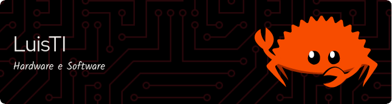

 

<h1 align="center">🦀🦀🦀Hi 👋, I'm Luis-TI.dev.br🦀🦀🦀</h1>
<h3 align="center">A passionate developer from Uruguay, living in São Paulo, Brasil.</h3>

  

- 🔭 I’m currently working on [m00wm](https://github.com/m00sp/m00wm)

- 🌱 I’m currently learning **Rust, Wasm, K8s.**

- 👯 I’m looking to collaborate on [Rust](https://github.com/rust-lang/rust)

- 🤝 I’m looking for help with [m00alpineupdate](https://github.com/m00sp/m00alpineupdate)

- 👨‍💻 All of my projects are available at [https://m00sp.github.io](https://m00sp.github.io)

- 📝 I regularly write articles on [https://m00sp.github.io/archive/](https://m00sp.github.io/archive/)

- 💬 Ask me about **Hardware and Software**

- 📫 How to reach me: see below.

- 📄 Know about my experiences [https://m00sp.github.io/cvs/](https://m00sp.github.io/cvs/)

<h3 align="center">Languages and Tools:</h3>

                         

  

<b>Visitors Count</b>

  

<h3>🔻 If you want to contact me, click here 🔻</h3>

<!--
**m00sp/m00sp** is a ✨ _special_ ✨ repository because its `README.md` (this file) appears on your GitHub profile.

  

<h3> If you support me, click here, give me a coffee</h3>

### Main skills:

 

 
  
 
 
 
  

<h2 align="left"> Studying in this moment: </h2>

 

  
 
 
 
 

-->

